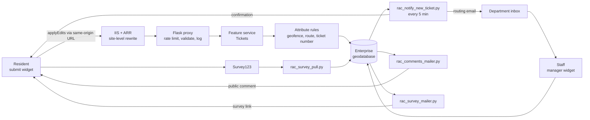

# Report a Concern

[](LICENSE) [](https://github.com/brianmcleer/report-a-concern/releases) [](https://github.com/brianmcleer/report-a-concern/issues)

A complete citizen service-request ("311 style") system built on ArcGIS Enterprise. Residents drop a pin, pick a category, add photos and submit. The system checks the location against service boundaries, routes the ticket to the right department, emails everyone who needs to know, lets staff work the ticket in a manager app, and closes the loop with a satisfaction survey.

Everything here is generalized. Hostnames, email addresses, department names and item ids all come from two git-ignored files (`scripts/config.py` and `scripts/rac_secrets.py`) plus the widget settings panels. Nothing in the code is tied to one organization.

## What is in the repository

| Folder | What it holds |
|--------|---------------|
| [widgets/report-a-concern-submit](widgets/report-a-concern-submit) | Experience Builder widget: the public four-step submission wizard with geofencing, category filtering, photo upload, profanity filter and a ticket status view. |
| [widgets/rac-manager](widgets/rac-manager) | Experience Builder widget: the staff ticket manager with status workflow, comments, photo lightbox, badge filters and Excel export. |
| [schema](schema) | Geodatabase builder (`build_schema.py`), data dictionary, attribute rule descriptions, XML workspace export helper and the SQL sequence. |
| [proxy](proxy) | Flask submission proxy that fronts the public feature service: rate limiting, payload and image validation, CORS allow-list, audit log. IIS rewrite rules included. |
| [scripts](scripts) | Seven Task Scheduler jobs: new-ticket notifications, reassignment notices, public comment mailer, survey invitation, survey pull from Survey123, directors report, monthly report. One shared `rac_common.py`. |
| [email-templates](email-templates) | WCAG 2.1 AA HTML email templates with `{token}` placeholders. |
| [tasks](tasks) | Windows Task Scheduler XML definitions for the proxy and the seven jobs. |
| [docs](docs) | Architecture, deployment runbook, operations, troubleshooting (symptom to cause to fix), security. |

## How it fits together



The [architecture doc](docs/architecture.md) has the full flow, the routing logic and the reasons behind the design choices (why the proxy exists, why notification flags are committed before the email is sent, why the audit table is not versioned).

## Quick start

1. Read [docs/deployment.md](docs/deployment.md). It is the ordered runbook.
2. Build the geodatabase: `schema/build_schema.py` (ArcGIS Pro Python, `DRY_RUN = True` first).
3. Publish the feature services and add the five attribute rules described in [schema/attribute_rules.md](schema/attribute_rules.md).
4. Drop the two widgets into `client/your-extensions/widgets/` and build the two apps.
5. Put the IIS rules from `proxy/web.config.example` at the site level, stand up the proxy.
6. Copy `scripts/config.example.py` to `config.py`, `scripts/rac_secrets.example.py` to `rac_secrets.py`, fill them in.
7. Import the Task Scheduler jobs from `tasks/`.
8. Leave `TESTING_MODE = True` until a test ticket has gone all the way through, then flip it.

## Requirements

ArcGIS Enterprise 11.x or 12.x with an enterprise geodatabase on SQL Server, Experience Builder Developer Edition 1.21, ArcGIS Pro (for its Python environment and arcpy), IIS with URL Rewrite 2.1 and Application Request Routing 3.0, an SMTP relay, and optionally Survey123 and an ArcGIS Online account for the survey loop.

## Releases

Each GitHub release carries one zip per widget (`rac-manager-<version>.zip`, `report-a-concern-submit-<version>.zip`). The zips are the widget folders only, with the Visual Studio type shims left out. Scripts, schema, proxy and docs are used from the repository.

## Publishing (maintainer)

`publish.ps1` mirrors both widgets from the Experience Builder source folders, refuses to run if a secrets file or an organization-specific string is in the tree, commits, pushes and optionally cuts a release. Run it in PowerShell (regular user) from this folder:

```powershell
powershell -ExecutionPolicy Bypass -File .\publish.ps1 -CommitMessage "Subject" -Release v1.0.0
```

## License

Apache License 2.0. Copyright 2026 City of Grand Junction, CO. See [LICENSE](LICENSE).
