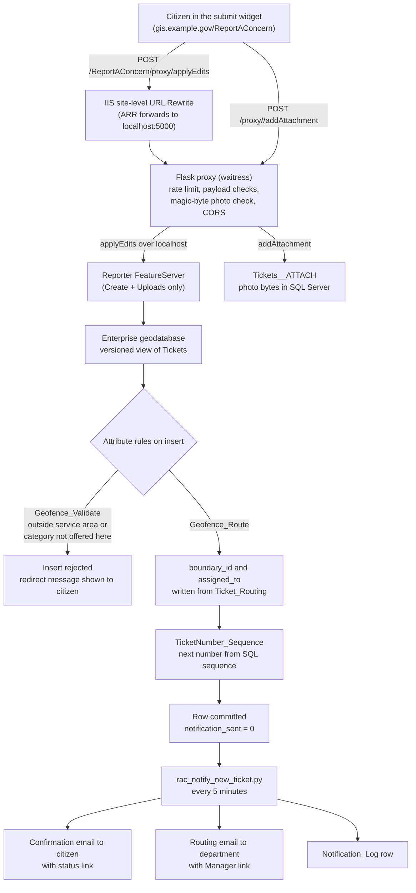

# Architecture

Report a Concern (RAC) is a citizen service-request system built on ArcGIS Enterprise. A member of the public drops a pin, picks a category, describes the problem, optionally attaches a photo, and submits. The database checks that the point is inside a service area, assigns the ticket to the responsible department by geography, and gives it a human-readable ticket number. Scheduled Python scripts then send the confirmation, routing, comment, reassignment and survey emails, and staff work the ticket in a separate password-protected manager app.

This page describes how the pieces fit together. [deployment.md](deployment.md) covers building it, [operations.md](operations.md) covers running it, [troubleshooting.md](troubleshooting.md) covers fixing it, and [security.md](security.md) covers the hardening layers.

## The five planes

The system is easiest to reason about as five planes. Each plane has a distinct trust level and a distinct set of hosts, and the boundaries between them are where the security controls live.

| Plane | What runs there | Trust level | Typical host |
|---|---|---|---|
| Public | Experience Builder submit app, the Flask proxy, the public ArcGIS Server site with the Reporter feature service and the geocoders | Anonymous internet traffic | `gis.example.gov` (public web server with IIS and ArcGIS Server) |
| Staff | Experience Builder manager app behind Portal sign-in, the Manager feature service | Authenticated staff on the network or VPN | `gis-internal.example.gov` (internal ArcGIS Server), `portal.example.gov` (Portal) |
| Data | One SQL Server enterprise geodatabase holding every table, the attribute rules, the SQL sequence and the photo attachments | Database logins only | `sql.example.gov` |
| Automation | Python scripts under Windows Task Scheduler and the always-on proxy process | Service account | Same server as the public plane |
| Reporting | Daily overdue-ticket report to directors, monthly all-department summary, and an internal read-only dashboard | Authenticated staff | Scripts on the public server; dashboard pages on the internal server |

The public plane can only write through the proxy. The staff plane writes directly to the feature service with a Portal token. The data plane is shared by both, which is what lets the manager see a ticket seconds after a citizen submits it, and also why the scheduled scripts must run on exactly one server at a time.

## New-submission data flow

In words, the sequence is:

1. The widget posts a single feature to `/ReportAConcern/proxy/applyEdits` on the same origin as the page. The widget never has the FeatureServer URL for writes.
2. IIS matches the site-level rewrite rule and Application Request Routing forwards the request to the waitress process on `localhost:5000`, adding an `X-Forwarded-For` header the proxy uses for rate limiting.
3. The proxy checks the per-IP rate limit, requires exactly one feature, requires the geometry to be numeric and inside a configured bounding box, requires a valid category code and a description, length-checks the contact fields, and confirms the request origin is on the CORS allow-list. Anything that fails is refused and logged to `Notification_Log` as `BLOCKED`.
4. The proxy forwards the edit over localhost to the Reporter feature service, which is published with Create and Uploads capabilities only.
5. The feature service inserts into the versioned view of `Tickets`, and the geodatabase fires the attribute rules. The constraint rules run first and can reject the insert with a citizen-facing message pulled from `Redirect_Contacts`. The routing calculation rule writes `boundary_id` and `assigned_to`. The sequence rule assigns `ticket_number`.
6. The row is committed with `notification_sent = 0`. The widget receives the new ObjectID and ticket number and shows a confirmation card with the status link.
7. If the citizen attached photos, the widget posts each one to `/proxy/<oid>/addAttachment`. The proxy sniffs the first bytes, replaces the declared MIME type with the detected one, and forwards to the attachment endpoint. Photos land as binary rows in `Tickets__ATTACH`.
8. Within five minutes `rac_notify_new_ticket.py` polls for `notification_sent = 0`, marks the ticket as notified, sends the confirmation email and the internal routing email, and writes one `Notification_Log` row per send. Why the flag is set before the email goes out is explained in [operations.md](operations.md#why-the-flag-is-committed-before-the-email-is-sent).

## Geofencing and two-tier routing

Geofencing is the reason the system exists: the ArcGIS Online reporter it replaced could not restrict categories by area or reject out-of-area submissions server-side. RAC does both inside the database so that no client can bypass it.

Three lookup tables drive it:

| Table | Purpose |
|---|---|
| `Service_Boundaries` | Polygon feature class. One row per service area (city limits, a utility district, a maintenance zone). `is_active` lets a boundary be switched off without deleting it. |
| `Category_Boundary_Lookup` | Which categories are offered in which boundary. `is_valid = 1` means the category may be submitted there. |
| `Ticket_Routing` | Which department owns a `(category, subcategory, boundary_id)` combination, with the department's routing email. `is_active` retires a row. A row with a NULL subcategory is the catch-all for its category and boundary. |

The widget queries `Service_Boundaries` client-side as the pin moves so the citizen gets immediate feedback, but that is cosmetic. The authoritative check is the constraint rule at insert time, which walks the same logic:

1. Filter `Service_Boundaries` to `is_active = 1` and find the polygons that intersect the submitted point. No intersecting polygon means the point is outside every service area, and the insert is rejected with the default redirect message.
2. For each intersecting boundary, look up `Category_Boundary_Lookup` for the submitted category with `is_valid = 1`. The first match wins and fixes `boundary_id`. No match means the category is not offered in that area, and the insert is rejected with the redirect message for that category and boundary (for example, telling the citizen which agency handles that problem there).
3. With the matched boundary and the submitted subcategory, query `Ticket_Routing` for `(category, subcategory, boundary_id)` with `is_active = 1`. If a row exists, `assigned_to` becomes that row's `default_assignee`.
4. If no subcategory-specific row exists, fall back to the row with the same category and boundary and a NULL subcategory. This is the catch-all, and every active category should have one per boundary.
5. If neither matches, `assigned_to` is left null. That is a routing gap and shows up in the monthly routing coverage check.

The notifier script repeats the same two-tier lookup in Python to find the routing email, so the email goes to the same department the rule chose. A routing row whose department is the explicit `Unknown` value sends to the triage address; a ticket with no routing row at all goes to the no-match fallback address. Both are set in `scripts/config.py`.

Departments that want several people to receive routing mail get a distribution list address in `assignee_email`, not duplicate rows. The Arcade rule takes the first matching row, so duplicates would route at random.

## Photo handling

Photos are ordinary FeatureServer attachments stored as binary in `Tickets__ATTACH`. There is no separate photo layer and no file share to back up. The design plan originally considered a Portal-hosted photo layer, but the hosted attachment endpoint requires a token even on a public item, which would have forced credentials into the public widget. Enterprise attachments through the proxy avoid that.

Validation happens three times, and only the last two count. The widget limits the citizen to three photos and checks the extension, which is a convenience. The proxy caps the size at `MAX_ATTACHMENT_BYTES`, sniffs the magic bytes for JPEG, PNG, WebP and HEIC/HEIF, and forwards the detected type rather than the declared one. The Reporter service itself is patched with `allowedUploadFileTypes` and `maxUploadFileSize`, which protects against anything that reaches the service by a route other than the proxy. The service patch is lost on every Experience Builder republish, so it is a standing step in the deployment procedure.

Staff can attach one photo to a comment. The photo takes the comment's visibility: a photo on a public comment appears on the citizen's status page, and a photo on an internal comment stays staff-only. Every photo is labeled by source (submitter, staff public, staff internal) in the manager.

## Ticket lifecycle and the manager

`ticket_id` (a GUID) is the primary key and appears in every related table. `ticket_number` is the display ID, starts at 10000, and comes from a SQL sequence so it never repeats even after test data is wiped.

Status is a five-value domain: Open, Received, In Progress, Resolved, Closed. Resolved and Closed are both terminal. The manager requires a note on every status change, and that note is written to `Ticket_Comments` as a public comment so the citizen is told why. Changing `assigned_to` writes an internal ASSIGN comment. Reassignment is detected by comparing `assigned_to` with `last_notified_assignee`, not by a flag the widget has to remember to set.

The manager app reads and writes the Manager feature service with the staff member's Portal token. It never touches the proxy, so the IIS rules on the public site are irrelevant to it. Categories and subcategories are read from the subtypes and domains at runtime, which is why adding a category needs no widget redeploy.

## Notification scripts

All scripts share `scripts/rac_common.py` for template rendering, SMTP, time zone conversion, failure alerts and `Notification_Log` writes, and read every environment-specific value from `scripts/config.py`.

| Script | Trigger | What it sends |
|---|---|---|
| `rac_notify_new_ticket.py` | `notification_sent = 0`, every 5 minutes | Citizen confirmation with status link; internal routing notice with Manager link |
| `rac_reassign_notify.py` | `assigned_to <> last_notified_assignee`, every 5 minutes | Reassignment notice to the new department |
| `rac_comments_mailer.py` | Public comment with `email_sent` not set, every 30 minutes | The comment or status note to the citizen |
| `rac_survey_mailer.py` | Status Resolved or Closed and `survey_sent = 0`, every 30 minutes | Satisfaction survey invitation with the Survey123 link |
| `rac_survey_pull.py` | Every 30 minutes | Nothing to citizens; imports survey responses and emails staff when a respondent asks for a callback |
| `rac_directors_report.py` | Weekdays at noon | Overdue-ticket report per director |
| `rac_all_dept_report.py` | First of the month | Summary to leadership |

Every send, successful or failed, writes a `Notification_Log` row with the ticket, recipient, subject and outcome. That table is the single answer to "did the system send that email".

## Survey loop

When a ticket becomes Resolved or Closed, `rac_survey_mailer.py` emails the citizen a Survey123 link with the `ticket_id` embedded as a hidden URL parameter (curly braces stripped). The email quotes the resolution note from the most recent RESOLUTION comment so the citizen remembers what was done.

`rac_survey_pull.py` reads new responses from the Survey123 feature layer in ArcGIS Online, skips any it has already imported for that ticket, and writes them to `Survey_Responses` in the geodatabase, including the rating and whether the respondent asked to be contacted. When the answer to the follow-up question is yes, the script emails the staff member who last edited the ticket (the editor-tracking field holds their email) with the ticket details, the rating and the respondent's comments. If that value is not a usable address, the follow-up goes to the department routing email or the configured fallback. The follow-up send runs after the import commits, so an SMTP failure never loses a response.

The internal dashboard reads `Survey_Responses` joined to `Tickets` to show average satisfaction overall and by department. Those panels are deliberately all-time rather than date-filtered, because a rolling window starves them of responses.

## Reporting and the retention ledger

The directors report and monthly report read the same tables the manager does. A separate monthly purge job implements the retention policy: tickets closed more than four years ago are summarized into a de-identified ledger (`Ticket_Retention_Summary`) as counts and sums by month, category, department and rating, and only then deleted along with their comments, photos, survey responses and log rows. A control table makes the run resumable and an audit table records every run. The ledger holds no ticket IDs, names or free text, so it can be kept indefinitely for long-range trends. See [security.md](security.md#pii-handling-and-retention).
